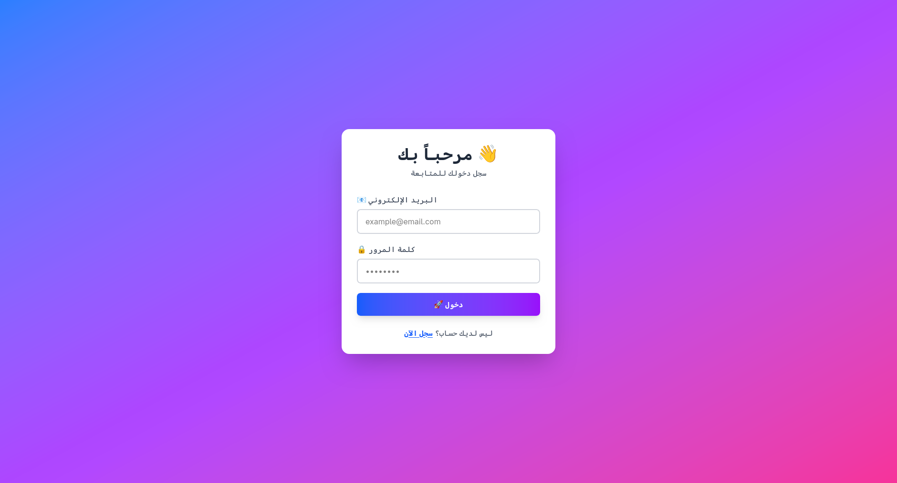
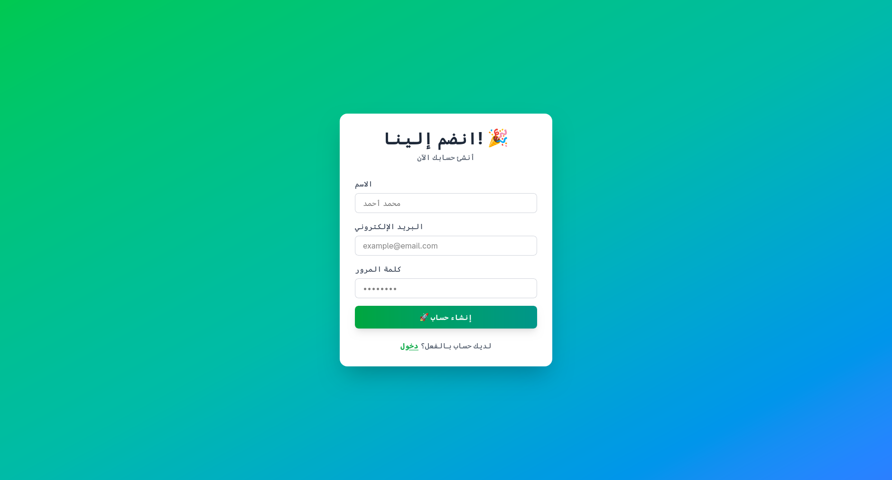
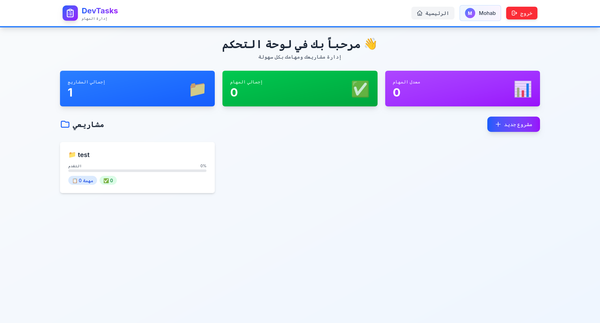
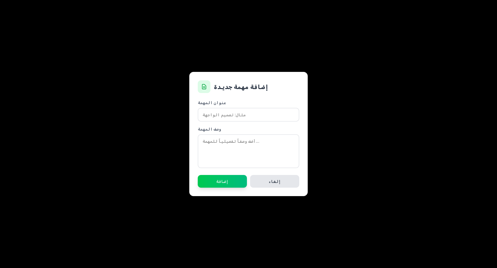
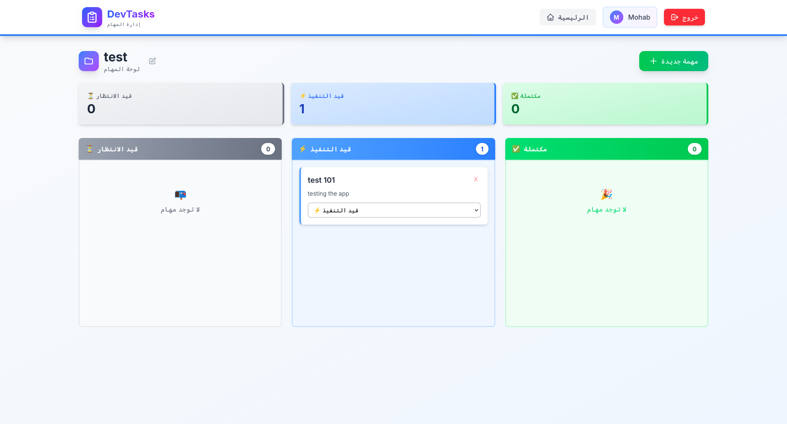

# DevTasks 📋

نظام إدارة المشاريع والمهام باللغة العربية

##  لقطات الشاشة

### تسجيل الدخول


### إنشاء حساب


### لوحة التحكم


### إدارة المهام


### إضافة مهمة


### اختبار المهام


## ⚡ التقنيات

- **Backend:** ASP.NET Core 8 + Entity Framework + SQLite + JWT
- **Frontend:** React 18 + TypeScript + Tailwind CSS v4 + Zustand

## 🚀 التشغيل

### Backend
```bash
cd DevTasks.Api
dotnet restore
dotnet ef database update
dotnet run
```

### Frontend
```bash
cd DevTasks.Web
npm install
npm run dev
```

## ✨ الميزات

✅ مصادقة المستخدمين
✅ إنشاء وإدارة المشاريع  
✅ لوحة كانبان للمهام  
✅ إحصائيات المشاريع  
✅ واجهة عربية كاملة  

---
**Made with ❤️ by Mohab**
